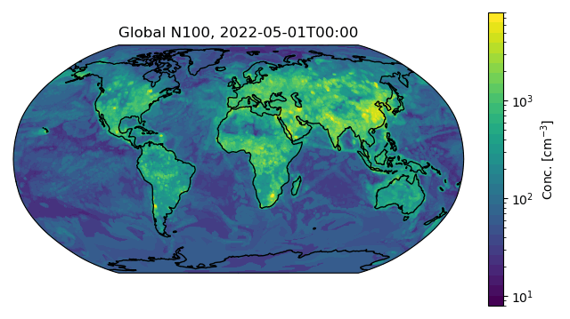

# ccn-globally



## Environment

```
conda create -n n100 python=3.7.0
conda activate n100
conda install -c conda-forge py-xgboost-gpu -y
conda install -c conda-forge jupyterlab matplotlib -y
conda install -c anaconda pandas jupyter seaborn -y
```

```
conda create -n geo
conda activate geo
conda install -c conda-forge xarray xgboost cartopy cfgrib
pip install gif
```
